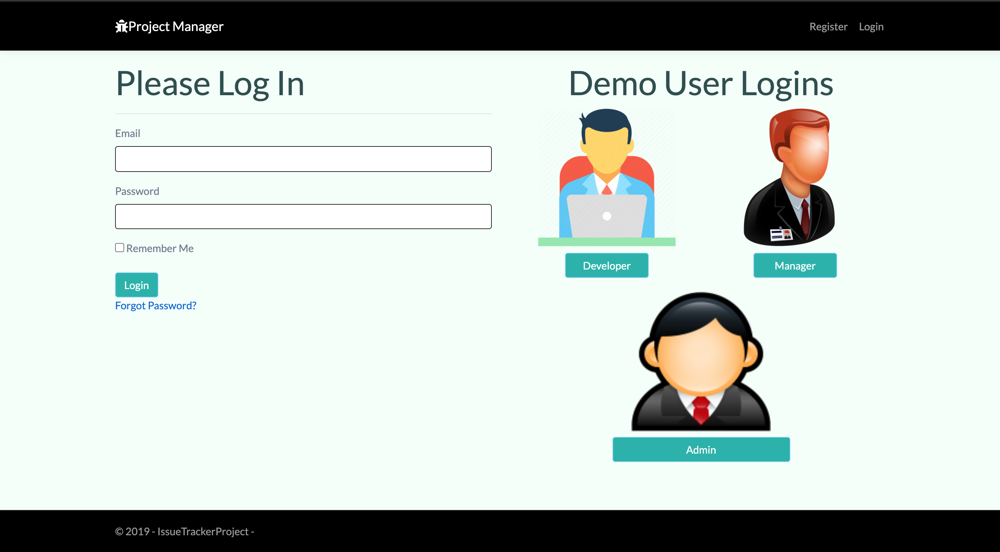

# ProjectIssuesManager --> LIVE DEMO (https://rb.gy/slh1z2)

An application for managing issues, bugs and roles for projects. Built using ASP.NET Core 3.1 MVC and PostgreSQL. 

There are three different roles and responsibilites that a signed up user potentially can have.

* Admin - Can see a list of all users, change user claims for all projects, create new projects, assign users to all projects, delete and manage details of projects and issues.
* Project Manager - Can see a list of all users, change user claims for one project, create new project, assign users to created projects and issues and bugs, delete and manage details of specific projects only.
* Developer - can see list of issues and bugs assigned to developer, can see projects it is part of (without the ability to change details), create a new issue/delete its own issue. Doesn't have the ability to manage and change any issues except his/her own.

Identity-Based Authentication and Policy-Based Claims Authorization to manage responsibilities.

# PostgreSQL

The data for the ASPNETUSERS, Identities and Claims are stored in PostgreSQL using GCP Google Cloud SQL instance. THe other tables are Project, Issue, ProjectIssues, IssueHistory, ProjectHistory, Screenshots. 

# Firebase Cloud Storage

Screenshots are stored using Google Firebase Cloud Storage. Create an account and store your credentials inside appsettings.json (Email, Password, Bucket and APIKEY).

# Deployment

You can easily deploy using Google Cloud Platform using Google App Engine (Flex). To protect anti-forgery and data protection (https://cloud.google.com/appengine/docs/flexible/dotnet/application-security), use

* Google.Cloud.AspNetCore.DataProtection.Kms;
* using Google.Cloud.AspNetCore.DataProtection.Storage;

---------------------------------------------------------------------------------------------------------------------------------------

---------------------------------------------------------------------------------------------------------------------------------------

---------------------------------------------------------------------------------------------------------------------------------------

---------------------------------------------------------------------------------------------------------------------------------------

